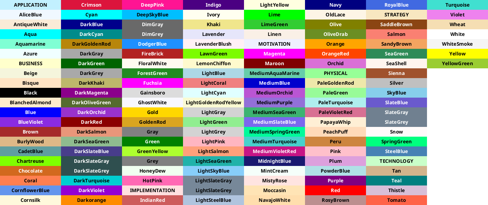
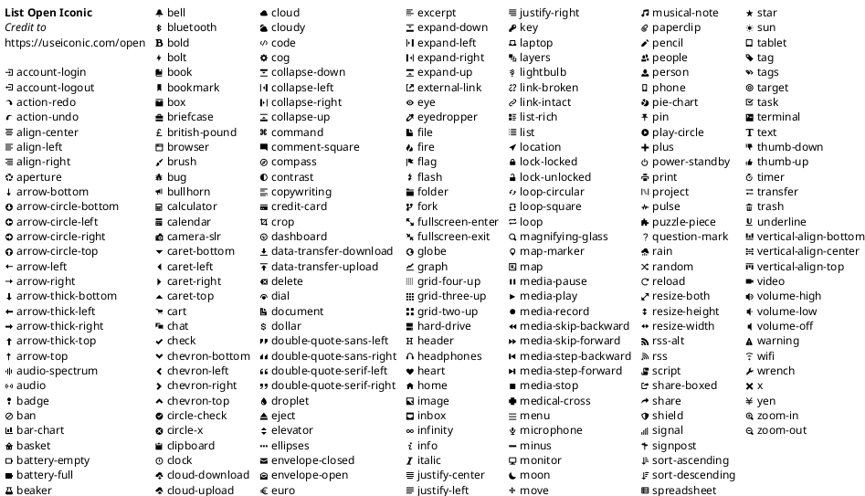
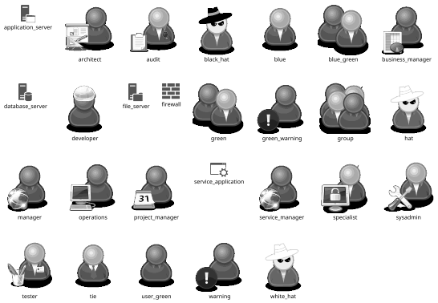

```plantuml
@startuml
title Legend
!include https://raw.githubusercontent.com/JohnLeyva/plantuml-assets/master/style-base.puml
$legend()
@enduml
```

```plantuml
@startuml
title Conventions
'skinparam linetype ortho
'!theme spacelab
!include https://raw.githubusercontent.com/JohnLeyva/plantuml-assets/master/style-simple.puml
'$example_style()
@enduml
```










